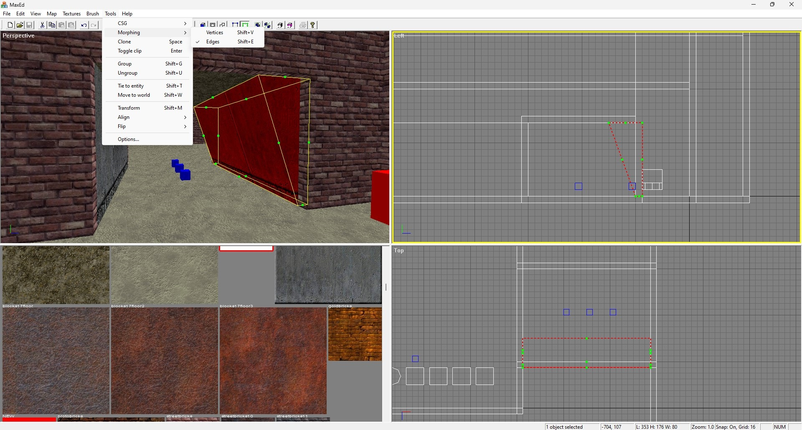
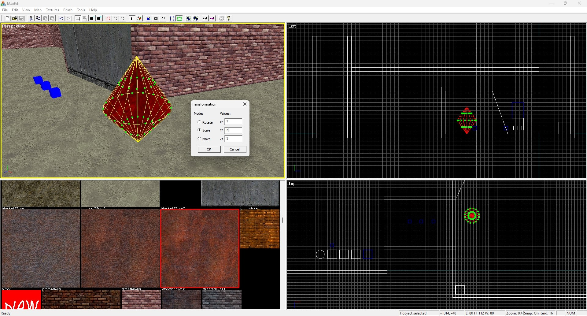

# MaxEd - level editor for a three-dimensional shooter game

-   рендер - OpenGL
-   интерфейс - MFC
-   вектора, списки, сортировка - STL
-   динамически изменяемая конфигурация окон-сплиттеров
-   выбор режимов проецирования для окна: 3D, 2D
    ( все 6 канонических проекций в режиме "ортогональный вид") + 3D + палитра текстур (текстурное окно)
-   режимы отображения в 2D/3D:
    -   Wired ("проволочный каркас")
    -   Solid (монотонный)
    -   Textured (текстурированный)
-   стандартные операции над брашами:

    -   Resize
    -   Rotate
    -   Shear

-   CSG операции над брашами:

    -   Carve (вырезание одним брашем в другом)
    -   Make Hollow ("авто-стены")
    -   Union (ЭКСКЛЮЗИВНАЯ ВОЗМОЖНОСТЬ! Автоматическая "сборка" браша из отдельных фрагментов с лучшим показателем оптимальности)

-   Морфинг
    -   по вертексам
    -   по ребрам
-   Клиппинг произвольно заданной плоскостью
-   Осевое выравнивание брашей
-   Осевой flipping ("зеркальное отражение") брашей
-   Произвольная, задаваемая пользователем трансформация
-   Работа с текстурами:
    -   сдвиг
    -   масштабирование
    -   поворот
    -   2D-юстировка (выравнивание текстуры в локальной системе координат грани):
        верх-низ-право-лево-центрирование.
-   Fitting текстуры по грани
-   Осевое выравнивание текстуры: по мировым осям/локально по грани
-   Кубическое пространственное отсечение для локализации видимых брашей (как в Q3Radiant)
-   Вертексное освещение
-   Редактор акторов (функциональных объектов игры) для сцены с настраиваемыми свойствами (через .ini файл)

## Краткий обзор

**Работа с акторами** (функциональными объектами игры): установка основных и дополнительных свойств. Паспорт акторов гибко подключается через .ini файл настроек игры

---

**Статистика** акторов на сцене

---

**Вертексная** манипуляция над брашами

---

**Edge** (манипуляция гранями браша)

---

Диалоговое окно **произвольной трансформации** объекта

---

**Клиппинг** браша произвольной плоскостью в 2D

---

### Эксклюзивная возможность - операция **CSG Union** (сборка браша из "осколков" по наиболее оптимальному алгоритму)

---

### Работа с текстурами

Помимо ручной работы с использованием стандартных операции UV-сдвиг, поворот, масштабирование, есть возможность точной настроки координат текстуры на диалоговом окне + автовыравнивание (2D-юстировка) в локальных координатах грани (по сторонам: лево/право/верх/низ/центр/растянуть)

